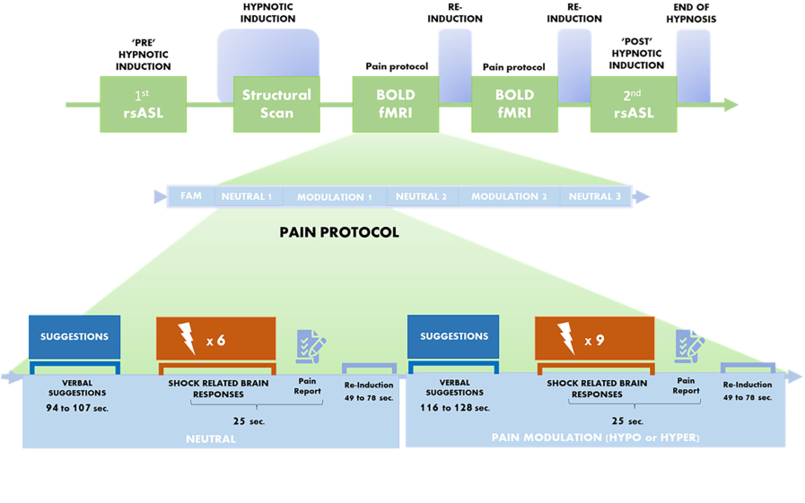

Brainhack readme file

# sutterlin_project

<a href="https://github.com/dylansutterlin">
    <b>Dylan Suttelrin-Guindon</b>
</a>

# Decoding of painful stimuli using fMRI data

# personal background
Education :
  * B.Sc. Neuroscience cognitive(fundamental research option)  from Université de Montréal

# Project definition

## Background

Pain is a multi-dimensional experience involving emotional, sensory and motivational aspects. Hypnosis is one intersting psychological 
 tool among many others (like placebo or meditation) that have been shown to effectively modulate pain. Verbal suggestions are an important component of hypnosis and are defined as verbal instructions that are intended to change or induce a cognition, behavior or sensory experience. In the case of pain, suggestions can be hyperalgesic or hypoalgesic, and are intended to increase or decrease pain, respectively. Verbal suggestions to reduce pain can reduce or amplify the brain activity evoked during painful experiences (e.g. during the administration of electrical shocks). 

Studies show that the experience of pain is not correlated with spatially restricted brain activity, but rather is the result of activity in several regions (e.g. anterior mid-Cingulate Cortex, insula, thalamus, somatosensory cortex). Given the distributed nature of brain activity during the experience of pain, multivariate pattern analyses seem to be a good approach to study the subjective experience of pain.

In order to better understand how verbal instructions (such as hyper/hypoalgesia) are integrated by the brain and then result in a modulation of brain activity during the administration of painful stimuli, this project aims to decode pain-related brain activity and identify activation patterns that predict a specific type of verbal suggestion. 

## Tools

A machine learning approach will be used to decode pain-evoked brain activity and predict verbal suggestions that was administered prior to painful stimulation.

The tools used to accomplish this task are:

* Python scripts
* Python modules (pandas, numpy, sklearn, nilearn, nibabel,  matplotlib, seaborn)
* Bash to run the scripts on elm server
* Git and Github to keep track of the project's evolution

# Data

The dataset that will be used comes from Desmartaux et al., 2021 and is access restricted. It includes 24 participants (13 women and 11 males) and mean age is 26.9. Subjects participated to a fMRI scanning session where they received hypnosis to either increase or decrease pain. After hypnotic suggestions to modulate pain,a serie of either 6 or 9 painful stimuli were administered. In total, each participant received 72 electrical shocks. Across all participants, a total of 1728 trials/shocks were done. 

## Method
 
A Support vector classifier from [sklearn documentation](https://scikit-learn.org/stable/modules/generated/sklearn.svm.SVC.html) was applied to 1726 statistical brain maps, each modeling the brain activation during a single painful shock. Those contrast maps were generated using a General Linear Model for which the code can be found [here](https://github.com/dylansutterlin/decoding_pain_experience). Those 1726 trials were used to predict the pain modulating condition administered prior to each shock. 

There were four different type of verbal suggestion to modulate (or not for the control sugestions) the pain experience. Hence, there were four classes to predict with the model. Those four classes are listed a the following : 

   * Hyperalgesia
   * Neutral suggestion in Hyperalgesia run
   * Hypoalgesia
   * Neutral suggestion in hypoalgeisa run

 
## Target deliverables

* Python scripts (main script that run the analyses)
* Metrics and statistics of the performances of the model
* Graphics (e.g. ROC curve, confusion matrix)
* fMRI maps of the voxels that best predicted suggestions plotted as 3D interactive plots
* A markdown README.md describing globaly the project and putting it in a scientific context
* Github repository provinding a fairly open science/reproductible aspect to the project

# Results

The SVC model was performed with a linear kernel
## Overview

## Actual deliverables

* - [] Python scripts (main script that run the analyses 
* - [x] Metrics and statistics of the performances of the model
* - [x] Graphics (e.g. ROC curve, confusion matrix)
* - [x] fMRI maps of the voxels that best predicted suggestions plotted as 3D interactive plots
* - [x] A markdown README.md describing globaly the project and putting it in a scientific context
* - [] Github repository provinding a fairly open science/reproductible aspect to the project

### Final script's structure
* data :Permission pending to give access to date (...)
* docs : A readme file descripbing the pipeline
* images : The images used in this README.me
* results : Saved metrics' dataframe, brain maps (.nii files) showing the voxels that were the most predictive of the target
* scripts : The main scripts with a function file that are called in main.py
* src : All the general function that can we reused wihout context

## Statistical model

* A nifti masker was used to project the 3 dimmensional contrast maps to 1 dimension with the argument `(mask_strategy = 'whole-brain-template', standardize = True)`
* Then a SVC was applied using on a K-fold cross-validation with the following parameters : `GroupShuffleSplit(n_splits = 5, test_size = 0.3, random_state = 33)`
* The results of each of the folds are presented as followed : 

* The final model was fitted all the training set and was then tested on a subset of data for that the model had never 'seen'. The metrics are presented as followed:

*****metrics + accuracy score*****

* With the final model, al the coefficients were reprojected to the MNI space using `masker.inverse_transform()` function. Since there were four classes, six different compirison of classes can be made and the highest coefficient for each comparison are presented in the interactive plots below.

## Conclusion

## Acknowledgement

## References
